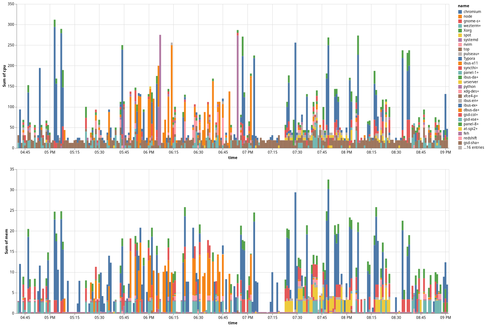

A simple script that collects CPU and memory usage from the leading processes listed by the `top` command and stores on a local sqlite database. Values are stores in a 'round-robin' fashion so older data gets removed when the storage hits its limits.

The collected can be later plotted using [vega-lite](https://vega.github.io/vega-lite), like this:



The number of processes as well as the maximum number of records stores can be adjusted in `mon.sh`.

## Dependencies

For collecting:
- top, awk
- sqlite3

For plotting:
- node, [vega-lite](https://vega.github.io/vega-lite)

## Usage

Start a store with:
```bash
DB_FILE=data.db ./mon.sh init
```

And record data with:

```bash
DB_FILE=data.db ./mon.sh record
```

Preferably, you may setup a cron like:

```bnash
*   *   *   *   *   cd <path-to-this-folder> && DB_FILE=data.db ./mon.sh record
```
which fetches data every minute. 

### Plotting:

To plot, simply do:
```bash
./plot.sh  # output to out.png 
# or
/plot.sh top-usage.png
```
## Notes

- Special thanks to [this post](https://lavag.org/topic/19394-sqlite-ring-buffer/) which explains how to use a sqlite3 table as a circular buffer. 

